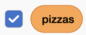
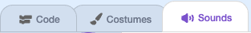

## Make the clicker

Add something to click and a score that goes up when you click it.

> [!TASK]
>
> Open a [fresh Scratch project](https://scratch.mit.edu/projects/editor/){:target="_blank"} in a new tab.

> [!TASK]
>
> Delete the cat sprite.
>
> 

> [!TASK]
>
> Add your own sprite with **Choose a Sprite** (library, **Upload**, or **Paint**).
>
> 
>
> Choose one clear thing players can click lots of times, such as food, treasure, a mascot, a ball, or something you draw yourself. The demo project uses a pizza.
>
> Use your own sprite, or save [the pizza sprite](images/pizza.png) and import it with **Upload**.
>
> 

> [!TASK]
>
> Make a score variable and give it a sensible plural name, such as `pizzas`, `coins`, `goals`, or `stars`. Tick it so the player can see their score.
>
> The demo blocks use `pizzas`{:class="block3variables"}. If you choose another name, use your variable wherever you see `pizzas`{:class="block3variables"}.
>
> 
>
> 

> [!TASK]
>
> Make your sprite clickable, so each click increases your score variable.
>
> <p align="center"></p>
>
> ```blocks3
> when this sprite clicked
> change [pizzas v] by (1)
> ```

Click your sprite. Your score variable goes up.

> [!TASK]
>
> Add a sound so a click feels good. Open the **Sounds** tab, click the speaker icon, and pick something short.
>
> 
>
> Add it to the top of your script. Use `start sound`{:class="block3sound"} in this project, not `play sound until done`{:class="block3sound"}, so the sound starts without holding up the rest of the program.
>
> ```blocks3
> when this sprite clicked
> +start sound (Tennis Hit v)
> change [pizzas v] by (1)
> ```

> [!TIP]
>
> Code that starts something and then keeps going is called **non-blocking** because it does not pause the rest of the program.

> [!TASK]
>
> Make the sprite bounce by changing its size when clicked.
>
> <p align="center"></p>
>
> ```blocks3
> when this sprite clicked
> start sound (Tennis Hit v)
> change [pizzas v] by (1)
> +change size by (10)
> +wait (0.05) seconds
> +change size by (-10)
> ```

> [!TIP]
>
> **Visual feedback** shows the player that an action worked. The bounce makes every click feel real, even before the player checks the score.

> [!TASK]
>
> Start a new script. On the green flag, set the sprite to `not draggable`{:class="block3sensing"} so the player clicks it instead of accidentally dragging it around the stage.
>
> <p align="center"></p>
>
> ```blocks3
> when green flag clicked
> set drag mode [not draggable v]
> ```

> [!TASK]
>
> Add the `Win`{:class="block3sound"} sound to your clicker sprite.

> [!TASK]
>
> Add the **win condition** to the same script. It waits until the score is high enough, then celebrates.
>
> ```blocks3
> when green flag clicked
> set drag mode [not draggable v]
> +wait until <(pizzas) > (10000)>
> +start sound (Win v)
> +say [You Win!] for (2) seconds
> +stop [all v]
> ```

> [!TIP]
>
> A **win condition** is the rule that decides when a player has completed or won a game.

> [!TASK]
>
> Click the `Stage`{:class="block3looks"} and reset the score on the green flag.
>
> 
>
> ```blocks3
> when green flag clicked
> set [pizzas v] to (0)
> ```

> [!TASK]
>
> **Test:** Click the green flag. Your score should start at 0 and climb each click.
