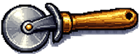
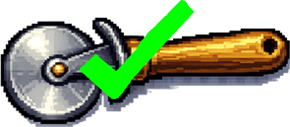

## Add equipment

Add equipment the player can unlock to make every click worth more.

> [!TASK]
>
> Make a variable called `pizzas per click`{:class="block3variables"}. This is how much one click adds to the demo project's score.
>
> If your score variable is not `pizzas`{:class="block3variables"}, give this variable a matching name, such as `coins per click` or `goals per click`.

> [!TIP]
>
> All the changing information a game remembers, like scores, prices, and upgrades, is called the **game state**.

> [!TASK]
>
> Click the `Stage`{:class="block3looks"} and set `pizzas per click`{:class="block3variables"} to `1` on the green flag, so a click always adds at least one.
>
> 
>
> ```blocks3
> when green flag clicked
> set [pizzas v] to (0)
> +set [pizzas per click v] to (1)
> ```

> [!TASK]
>
> On your main clicker sprite, make each click use the variable instead of a fixed `1`.
>
> <p align="center"></p>
>
> ```blocks3
> when this sprite clicked
> start sound (Tennis Hit v)
> +change [pizzas v] by (pizzas per click)
> change size by (10)
> wait (0.05) seconds
> change size by (-10)
> ```

Nothing changes yet, because `pizzas per click`{:class="block3variables"} is still `1`. The equipment will raise it.

> [!TASK]
>
> Add your first piece of equipment as a new sprite. Choose something that looks like it would improve each click, such as a tool, machine, power-up, or badge. The demo project uses a cutter.
>
> Use your own equipment, or save [the cutter sprite](images/cutter.png) and import it with **Upload**.
>
> 

> [!TASK]
>
> In the **Costumes** tab, right-click the equipment costume and choose **duplicate**. Keep the plain costume first and the copied costume second.
>
> 

> [!TASK]
>
> Change the second costume so it clearly shows the equipment has been bought. The demo project adds a green tick.
>
> 

> [!TASK]
>
> Add the `Alert`{:class="block3sound"} sound to your equipment sprite.

> [!TASK]
>
> Set up the equipment on the green flag: make it not draggable, switch to the plain costume, and hide it.
>
> <p align="center"></p>
>
> ```blocks3
> when green flag clicked
> set drag mode [not draggable v]
> switch costume to (cutter v)
> hide
> ```

> [!TASK]
>
> Make the equipment appear only once the player can afford it.
>
> The cutter costs `25` of the score variable, so it appears when the player has more than `24`. Use bigger numbers to make later equipment more expensive.
>
> ```blocks3
> when green flag clicked
> set drag mode [not draggable v]
> switch costume to (cutter v)
> hide
> +wait until <(pizzas) > (24)>
> +show
> +start sound (Alert v)
> ```

> [!TIP]
>
> An **unlock condition** is a rule that makes something available only after the player has done enough.

> [!TASK]
>
> Add the `Tada`{:class="block3sound"} sound to your equipment sprite.

> [!TASK]
>
> Make it buyable. Clicking it spends `25` of the score variable, upgrades the player's clicks, and switches to the "bought" costume.
>
> The `costume number = 1` check means only the plain costume can be bought, so the player cannot buy the same upgrade twice.
>
> <p align="center"></p>
>
> ```blocks3
> when this sprite clicked
> if <<(costume [number v]) = (1)> and <(pizzas) > (24)>> then
> start sound (Tada v)
> change [pizzas v] by (-25)
> set [pizzas per click v] to (2)
> next costume
> end
> ```

Click until the score reaches 25. The cutter appears; click it to spend 25 and make every click worth 2.

> [!TIP]
>
> Game developers often build and test one working **prototype** first. Fixing the cutter before copying its scripts makes problems easier to find.

> [!TASK]
>
> Add two more pieces of equipment. Copy the two cutter scripts by dragging each onto the new sprite in the sprite list, then change the numbers.
>
> The demo project's rolling pin costs `500` of the score variable and sets `pizzas per click`{:class="block3variables"} to `6`.
>
> 
>
> Save [the rolling pin sprite](images/rolling_pin.png) and import it with **Upload** if you want to use the demo project's equipment.
>
> > [!NOPRINT]
> >
> > 

> [!TASK]
>
> Add the `Alert`{:class="block3sound"} and `Tada`{:class="block3sound"} sounds to each extra equipment sprite too. Then update the copied scripts for the rolling pin.
>
> <p align="center"></p>
>
> ```blocks3
> when green flag clicked
> set drag mode [not draggable v]
> switch costume to (rolling_pin v)
> hide
> wait until <(pizzas) > (499)>
> show
> start sound (Alert v)
> ```
>
> ```blocks3
> when this sprite clicked
> if <<(costume [number v]) = (1)> and <(pizzas) > (499)>> then
> start sound (Tada v)
> change [pizzas v] by (-500)
> set [pizzas per click v] to (6)
> next costume
> end
> ```

> [!TASK]
>
> Add a third the same way: the oven costs `3000` of the score variable and sets `pizzas per click`{:class="block3variables"} to `24`. Give each sprite its own first costume in its setup script.
>
> 
>
> Save [the oven sprite](images/oven.png) and import it with **Upload** if you want to use the demo project's equipment.
>
> <p align="center"></p>
>
> ```blocks3
> when green flag clicked
> set drag mode [not draggable v]
> switch costume to (oven v)
> hide
> wait until <(pizzas) > (2999)>
> show
> start sound (Alert v)
> ```
>
> ```blocks3
> when this sprite clicked
> if <<(costume [number v]) = (1)> and <(pizzas) > (2999)>> then
> start sound (Tada v)
> change [pizzas v] by (-3000)
> set [pizzas per click v] to (24)
> next costume
> end
> ```

> [!TASK]
>
> Make winning need all the upgrades. On your main clicker sprite, update the `wait until`{:class="block3control"} so the player needs a high score **and** all the equipment (which lands `pizzas per click`{:class="block3variables"} on `24` in the demo project).
>
> <p align="center"></p>
>
> ```blocks3
> when green flag clicked
> set drag mode [not draggable v]
> +wait until <<(pizzas) > (10000)> and <(pizzas per click) = (24)>>
> start sound (Win v)
> say [You Win!] for (2) seconds
> stop [all v]
> ```

Buy all three pieces of equipment. The win message now only appears once the demo project is fully kitted out.
