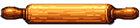
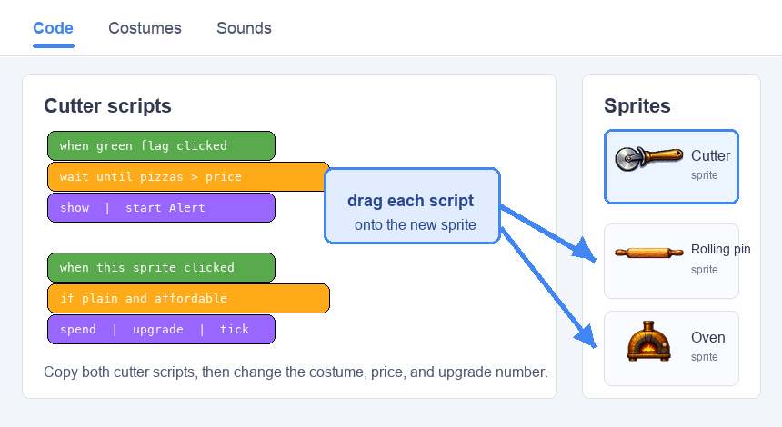
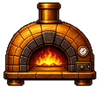
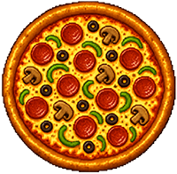

## Add more equipment

Build on the cutter prototype with two more upgrades that make every click worth even more.

> [!TASK]
>
> Add a rolling pin as a new sprite.
>
> 
>
> Use your own equipment, or save [the rolling pin sprite](images/rolling_pin.png) and import it with **Upload**.

> [!TASK]
>
> Open the rolling pin's **Costumes** tab. Right-click its costume and choose **duplicate**, keeping the plain costume first and the copied costume second.
>
> Add a green tick to the second costume so the player can see when the rolling pin has been bought.

> [!TASK]
>
> Copy the cutter's two scripts onto the rolling pin by dragging each script onto the rolling pin in the sprite list. Add the `Alert`{:class="block3sound"} and `Tada`{:class="block3sound"} sounds too.
>
> > [!NOPRINT]
> >
> > 

> [!TASK]
>
> Update the copied scripts for the rolling pin. It costs `500` and sets `pizzas per click`{:class="block3variables"} to `6`.
>
> <p align="center"></p>
>
> ```blocks3
> when green flag clicked
> set drag mode [not draggable v]
> switch costume to (rolling_pin v)
> hide
> wait until <(pizzas) > (499)>
> show
> start sound (Alert v)
> ```
>
> ```blocks3
> when this sprite clicked
> if <<(costume [number v]) = (1)> and <(pizzas) > (499)>> then
> start sound (Tada v)
> change [pizzas v] by (-500)
> set [pizzas per click v] to (6)
> next costume
> end
> ```

Click until the score reaches 500. The rolling pin appears; click it to buy it and check that its green-tick costume appears.

> [!TASK]
>
> Add an oven as a new sprite.
>
> 
>
> Use your own equipment, or save [the oven sprite](images/oven.png) and import it with **Upload**.

> [!TASK]
>
> Open the oven's **Costumes** tab. Right-click its costume and choose **duplicate**, keeping the plain costume first and the copied costume second.
>
> Add a green tick to the second costume so the player can see when the oven has been bought.

> [!TASK]
>
> Copy the cutter's two scripts onto the oven by dragging each script onto the oven in the sprite list. Add the `Alert`{:class="block3sound"} and `Tada`{:class="block3sound"} sounds too.

> [!TASK]
>
> Update the copied scripts for the oven. It costs `3000` and sets `pizzas per click`{:class="block3variables"} to `24`.
>
> <p align="center"></p>
>
> ```blocks3
> when green flag clicked
> set drag mode [not draggable v]
> switch costume to (oven v)
> hide
> wait until <(pizzas) > (2999)>
> show
> start sound (Alert v)
> ```
>
> ```blocks3
> when this sprite clicked
> if <<(costume [number v]) = (1)> and <(pizzas) > (2999)>> then
> start sound (Tada v)
> change [pizzas v] by (-3000)
> set [pizzas per click v] to (24)
> next costume
> end
> ```

Click until the score reaches 3000. Buy the oven and check that its green-tick costume appears and each click is worth 24.

> [!TASK]
>
> Make winning need all the upgrades. On your main clicker sprite, update the `wait until`{:class="block3control"} so the player needs a high score **and** all the equipment (which sets `pizzas per click`{:class="block3variables"} to `24` in the demo project).
>
> <p align="center"></p>
>
> ```blocks3
> when green flag clicked
> set drag mode [not draggable v]
> +wait until <<(pizzas) > (10000)> and <(pizzas per click) = (24)>>
> start sound (Win v)
> say [You Win!] for (2) seconds
> stop [all v]
> ```

Buy all three pieces of equipment. The win message now only appears once the demo project is fully kitted out.
