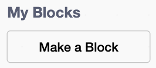

## Add auto-clickers

Add a helper that makes pizzas every second, even when the player stops clicking. The player can hire the same type of helper more than once, and each one adds another pizza per second.

> [!TASK]
>
> Add a helper sprite. Choose a character or machine that looks like it could work automatically. The demo project uses a chef.
>
> 
>
> Use your own helper, or save [the chef sprite](images/chef.png) and import it with **Upload**.

> [!TASK]
>
> Select the helper and use the **Size** box below the Stage to make it fit. The demo project's chef is `30`% size.
>
> Drag it to an empty part of the Stage where it will not cover the score or equipment. The demo project puts the chef on the right.

> [!TASK]
>
> Add the `Clang`{:class="block3sound"} sound to the helper sprite.

> [!TASK]
>
> Make a variable called `helpers`{:class="block3variables"}. It stores how many of this first helper the player has hired.

> [!TASK]
>
> Make a variable called `helper price`{:class="block3variables"}. It stores how many pizzas the next helper costs.

> [!TASK]
>
> Make a variable called `pizzas per second`{:class="block3variables"}. It shows how many pizzas all the helpers make during each second.

> [!TASK]
>
> Click the `Stage`{:class="block3looks"} and give the helper variables starting values on the green flag.
>
> The first helper costs `50`, so the cutter still unlocks first at `25`.
>
> 
>
> ```blocks3
> when green flag clicked
> set [pizzas v] to (0)
> set [pizzas per click v] to (1)
> +set [helpers v] to (0)
> +set [helper price v] to (50)
> +set [pizzas per second v] to (0)
> ```

Click the green flag. The new readouts should show `helpers 0`, `helper price 50`, and `pizzas per second 0`.

> [!TASK]
>
> On the helper sprite, start its buy script. Clicking the helper spends its current price and hires one helper.
>
> The `change`{:class="block3variables"} block needs a negative number to spend pizzas. `0 - helper price` turns the price into that negative number.
>
> <p align="center"></p>
>
> ```blocks3
> when this sprite clicked
> start sound (Clang v)
> change [pizzas v] by ((0) - (helper price))
> change [helpers v] by (1)
> ```

> [!TASK]
>
> Add a block to make the next helper cost about 15% more.
>
> Multiplying by `1.15` adds 15% to the old price. `round`{:class="block3operators"} keeps the new price as a whole number.
>
> ```blocks3
> when this sprite clicked
> start sound (Clang v)
> change [pizzas v] by ((0) - (helper price))
> change [helpers v] by (1)
> +set [helper price v] to (round ((helper price) * (1.15)))
> ```

The first helper costs 50 pizzas. After buying it, `helpers` should be `1` and `helper price` should be `58`.

> [!TIP]
>
> A **progression curve** controls how quickly a game gets harder, faster, or more expensive as the player improves.

> [!TASK]
>
> Make the helper appear only when the player can afford the current price.
>
> Scratch has no `greater than or equal to` block. Because the score uses whole numbers, checking for `pizzas > helper price - 1` does the same job.
>
> <p align="center"></p>
>
> ```blocks3
> when green flag clicked
> set drag mode [not draggable v]
> hide
> forever
> if <(pizzas) > ((helper price) - (1))> then
> show
> else
> hide
> end
> end
> ```

Click the green flag and click the main sprite. The helper should stay hidden up to 49 pizzas and appear when the score reaches 50.

> [!TASK]
>
> Click the `Stage`{:class="block3looks"}. In `My Blocks`{:class="block3custom"}, click **Make a Block**, name it `update pizzas per second`{:class="block3custom"}, and build its definition.
>
> Each helper makes one pizza per second, so the rate is the same as the number stored in `helpers`{:class="block3variables"}.
>
> 
>
> 
>
> ```blocks3
> define update pizzas per second
> set [pizzas per second v] to (helpers)
> ```

> [!TIP]
>
> In many programming languages, a reusable block of code like this is called a **function**.

> [!TASK]
>
> Still on the Stage, add a script that runs the new block whenever a helper asks for the rate to be updated.
>
> In the `when I receive`{:class="block3events"} block, open the message menu, choose **New message**, and name it `update`.
>
> ```blocks3
> when I receive (update v)
> update pizzas per second :: custom
> ```

> [!TASK]
>
> Return to the helper sprite. Broadcast `update` at the end of its buy script so the Stage recalculates the rate after every purchase.
>
> ```blocks3
> when this sprite clicked
> start sound (Clang v)
> change [pizzas v] by ((0) - (helper price))
> change [helpers v] by (1)
> set [helper price v] to (round ((helper price) * (1.15)))
> +broadcast (update v)
> ```

> [!TASK]
>
> On the Stage, finish the green flag script with the game's clock. Every second, it adds the current `pizzas per second`{:class="block3variables"} rate to the score.
>
> ```blocks3
> when green flag clicked
> set [pizzas v] to (0)
> set [pizzas per click v] to (1)
> set [helpers v] to (0)
> set [helper price v] to (50)
> update pizzas per second :: custom
> forever
> wait (1) seconds
> change [pizzas v] by (pizzas per second)
> end
> ```

> [!TIP]
>
> A regular moment when a game updates its numbers is called a **tick**. This clicker has one tick every second.

Click the green flag, earn 50 pizzas, and buy one helper. Check that `helpers` becomes `1` and `pizzas per second` becomes `1`, then stop clicking. The score should rise by one every second.

The helper is a repeatable upgrade. When the score reaches its new price, the same sprite appears again so the player can hire another one.
