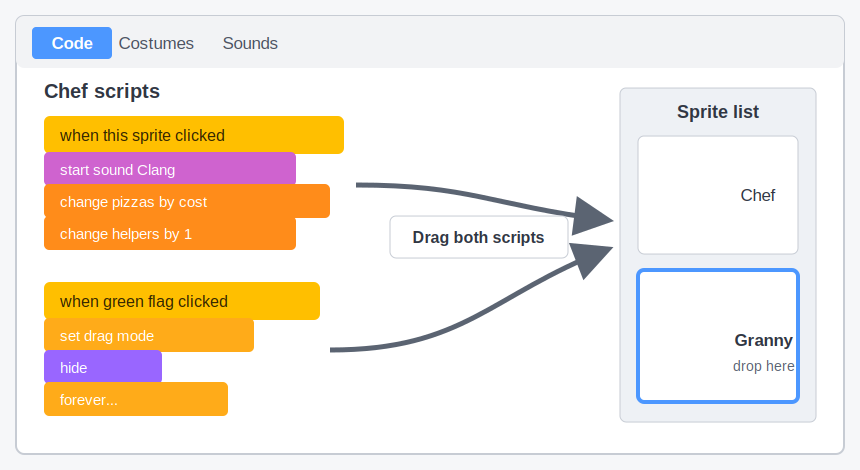

## Add a second helper

Add a second, more powerful helper that makes five pizzas per second instead of one.

> [!TASK]
>
> Add another helper sprite. The demo project uses a granny.
>
> 
>
> Use your own helper, or save [the granny sprite](images/granny.png) and import it with **Upload**.

> [!TASK]
>
> Use the **Size** box below the Stage to resize the second helper, then drag it into a clear position. The demo project's granny is `30`% size and sits below the chef on the right.

> [!TASK]
>
> Copy your first helper's two scripts onto the new sprite: drag each script from the code area and drop it onto the new sprite in the sprite list.
>
> > [!NOPRINT]
> >
> > 

> [!TASK]
>
> Make a variable called `grannies`{:class="block3variables"} for how many of the second helper the player has hired.

> [!TASK]
>
> Make a variable called `granny price`{:class="block3variables"} for how many pizzas the next one costs.

> [!TASK]
>
> Add the `Collect`{:class="block3sound"} sound to the second helper sprite.

> [!TASK]
>
> Click the `Stage`{:class="block3looks"} and add starting values for the new variables. The second helper starts at `100` pizzas because it works five times faster.
>
> 
>
> ```blocks3
> when green flag clicked
> set [pizzas v] to (0)
> set [pizzas per click v] to (1)
> set [helpers v] to (0)
> set [helper price v] to (50)
> +set [grannies v] to (0)
> +set [granny price v] to (100)
> update pizzas per second :: custom
> forever
> wait (1) seconds
> change [pizzas v] by (pizzas per second)
> end
> ```

Click the green flag. The new readouts should show `grannies 0` and `granny price 100`.

> [!TASK]
>
> On the second helper, update the copied buy script to use its sound, count, and price.
>
> The `broadcast`{:class="block3events"} stays at the end because buying either type of helper changes the pizzas-per-second rate.
>
> <p align="center"></p>
>
> ```blocks3
> when this sprite clicked
> start sound (Collect v)
> change [pizzas v] by ((0) - (granny price))
> change [grannies v] by (1)
> set [granny price v] to (round ((granny price) * (1.15)))
> broadcast (update v)
> ```

> [!TASK]
>
> Update the copied green flag script so the second helper appears only when its own price is affordable.
>
> <p align="center"></p>
>
> ```blocks3
> when green flag clicked
> set drag mode [not draggable v]
> hide
> forever
> if <(pizzas) > ((granny price) - (1))> then
> show
> else
> hide
> end
> end
> ```

Click the green flag and build the score. The first helper should appear at 50 pizzas and the second helper at 100 pizzas.

> [!TASK]
>
> On the `Stage`{:class="block3looks"}, update the `update pizzas per second`{:class="block3custom"} definition.
>
> The number of first helpers is already their contribution because each makes one pizza per second. Each granny makes five, so multiply only `grannies`{:class="block3variables"} by `5`.
>
> 
>
> ```blocks3
> define update pizzas per second
> set [pizzas per second v] to ((helpers) + ((grannies) * (5)))
> ```

> [!TIP]
>
> Choosing costs and rewards so each upgrade feels worthwhile is called **game balancing**.

Buy one first helper and one granny. `pizzas per second` should become `6`: one from the first helper and five from the granny. Stop clicking and check that the score rises by six each second.

You now have a full endless clicker: clicks, equipment, and repeatable helpers all working together.

> [!TIP]
>
> Clicking, earning, buying upgrades, and then earning faster form the game's **core loop**.
